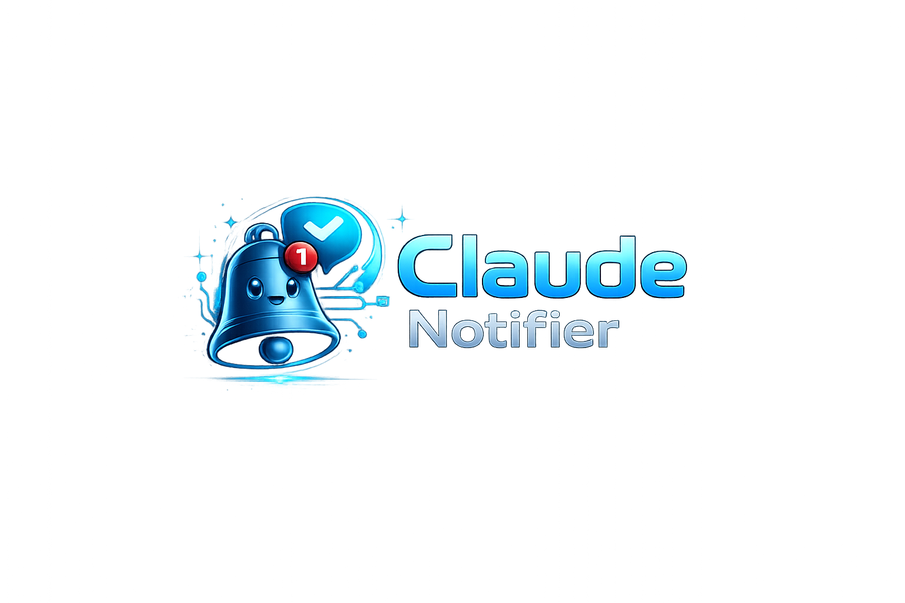

# Claude-Notifier

Play a system sound and show a desktop toast whenever Claude Code finishes a task or asks you a question. Cross-platform. One-line install. No dependencies.



> 🇹🇷 **Türkçe:** [README.tr.md](./README.tr.md)

## Install

**Windows (PowerShell):**

```powershell
& ([scriptblock]::Create((irm https://cdn.jsdelivr.net/gh/MuratBilginerSoft/Claude-Notifier@main/install.ps1)))
```

<details>
<summary>Why not <code>irm | iex</code>?</summary>

`irm | iex` evaluates the downloaded text as an expression, but `install.ps1` declares a `param(...)` block — and `param()` is only valid at the start of a script block, not inside an expression. `[scriptblock]::Create(...)` turns the downloaded text into a real script block, and `&` invokes it. This also lets you pass parameters cleanly: `& ([scriptblock]::Create((irm ...))) -Uninstall`.

</details>

**macOS / Linux (requires `jq`):**

```bash
curl -fsSL https://cdn.jsdelivr.net/gh/MuratBilginerSoft/Claude-Notifier@main/install.sh | bash
```

Open a new Claude Code session or run `/hooks` to load the new settings.

## How it works

The installer drops a tiny helper script in `~/.claude-notifier/` and adds two hooks to `~/.claude/settings.json` — one for the `Stop` event (task complete) and one for `Notification` (Claude needs attention). Existing hooks are preserved.

The runtime helper picks the right API per platform: `SystemSounds` + WinRT toast on Windows, `afplay` + `osascript` on macOS, `paplay` + `notify-send` on Linux.

## Customize

All configuration is through environment variables — set them in your shell or in `~/.claude/settings.json` `env` field.

| Variable                               | Values                                      | Default               | Purpose                                      |
|----------------------------------------|---------------------------------------------|-----------------------|----------------------------------------------|
| `CLAUDE_NOTIFIER_LANG`                 | `en`, `tr`                                  | `en`                  | Message language                             |
| `CLAUDE_NOTIFIER_EVENTS`               | `stop`, `notification`                      | `stop,notification`   | Which events trigger notifications (CSV)     |
| `CLAUDE_NOTIFIER_SOUND`                | `0`, `1`                                    | `1`                   | Enable/disable sound                         |
| `CLAUDE_NOTIFIER_TOAST`                | `0`, `1`                                    | `1`                   | Enable/disable toast                         |
| `CLAUDE_NOTIFIER_SOUND_STOP`           | built-in name, or absolute path to audio    | _(platform default)_  | Override sound for the **Stop** event        |
| `CLAUDE_NOTIFIER_SOUND_NOTIFICATION`   | built-in name, or absolute path to audio    | _(platform default)_  | Override sound for the **Notification** event |

**Sound override values:**

- **Windows:** one of the built-in names `Asterisk`, `Beep`, `Exclamation`, `Hand`, `Question` (case-insensitive), **or** an absolute path to a `.wav` file.
- **macOS / Linux:** an absolute path to an audio file. macOS plays via `afplay` (supports `.aiff`, `.wav`, `.mp3`, `.m4a`, …). Linux plays via `paplay` with `aplay` fallback.

If the value is invalid or the file is missing, the script logs a warning to stderr and falls back to the platform default.

**Toast branding:**

Toasts appear as "Claude Notifier - BrainyTech" with a bell icon. On **Windows** the name + icon are registered at install time under `HKCU:\SOFTWARE\Classes\AppUserModelId\BrainyTech.ClaudeNotifier` (uninstall removes the key). On **Linux** the icon is loaded via `notify-send -i` from `~/.claude-notifier/icon.png`. macOS `display notification` doesn't support custom icons.

**Context excerpt:**

Toasts include a short preview (up to 200 characters) so you can tell at a glance *what* just happened without switching back:

- **Notification:** Claude's prompt message (e.g. "Claude wants to run `git push` — do you approve?").
- **Stop:** the last paragraph of Claude's response, pulled from the session transcript.

Multiline text is collapsed to a single line and truncated with `…`. If the hook payload is missing or unparseable, the toast falls back to the generic event message.

Example — silent mode, only trigger on questions, Turkish text:

```json
{
  "env": {
    "CLAUDE_NOTIFIER_SOUND": "0",
    "CLAUDE_NOTIFIER_EVENTS": "notification",
    "CLAUDE_NOTIFIER_LANG": "tr"
  }
}
```

Example — custom sounds on Windows:

```json
{
  "env": {
    "CLAUDE_NOTIFIER_SOUND_STOP": "Beep",
    "CLAUDE_NOTIFIER_SOUND_NOTIFICATION": "C:\\Sounds\\ding.wav"
  }
}
```

## Uninstall

**Windows:**

```powershell
& ([scriptblock]::Create((irm https://cdn.jsdelivr.net/gh/MuratBilginerSoft/Claude-Notifier@main/install.ps1))) -Uninstall
```

**macOS / Linux:**

```bash
curl -fsSL https://cdn.jsdelivr.net/gh/MuratBilginerSoft/Claude-Notifier@main/install.sh | bash -s -- --uninstall
```

Uninstall removes only `claude-notifier`'s hook entries and its helper directory. Any other hooks you've configured are preserved.

## Security — want to read before you run?

This project uses the `curl | bash` install pattern. If you prefer to inspect before running:

```bash
curl -fsSL https://cdn.jsdelivr.net/gh/MuratBilginerSoft/Claude-Notifier@main/install.sh -o install.sh
less install.sh
bash install.sh
```

## Requirements

- **Windows:** Windows 10 build 19041+ or Windows 11, PowerShell 5.1+
- **macOS:** macOS 12+ (Monterey or newer)
- **Linux:** bash, `jq`, and a notification daemon (`notify-send` via `libnotify-bin`); sound via `pulseaudio` or `alsa-utils`

## Troubleshooting

- **"Nothing happened after install"** → open `/hooks` once in Claude Code, or restart the CLI. The hook watcher picks up settings changes on next reload.
- **Linux: sound but no toast** → install `libnotify-bin` (`sudo apt install libnotify-bin`)
- **Windows: toast doesn't show, sound works** → make sure Focus Assist isn't blocking notifications

## Contributing

PRs welcome. Keep it dependency-free and under ~200 lines per script.

## License

MIT — see [LICENSE](./LICENSE).
